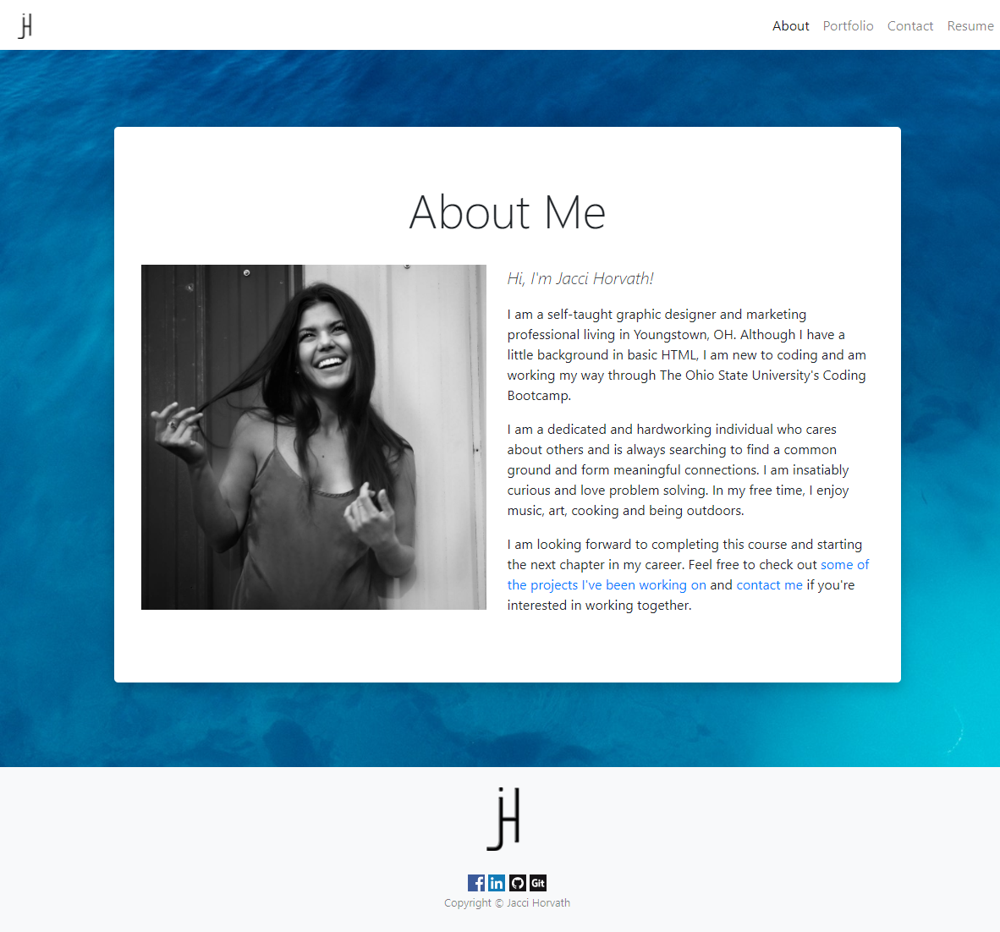
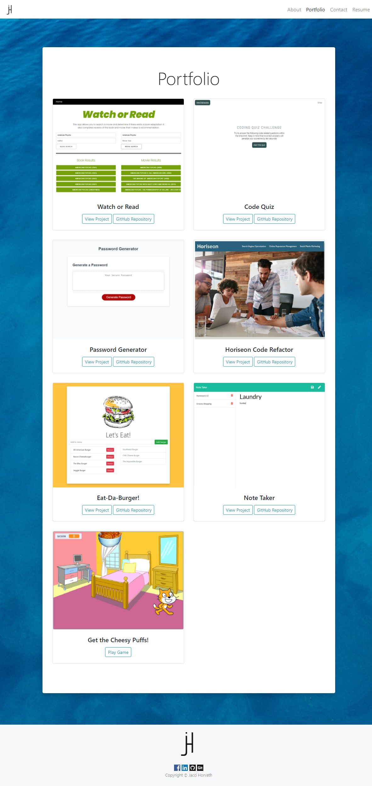
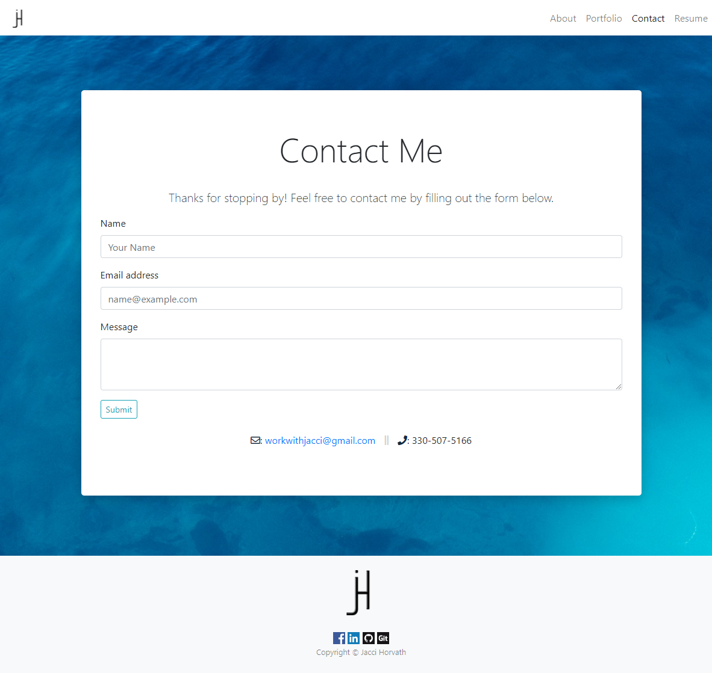
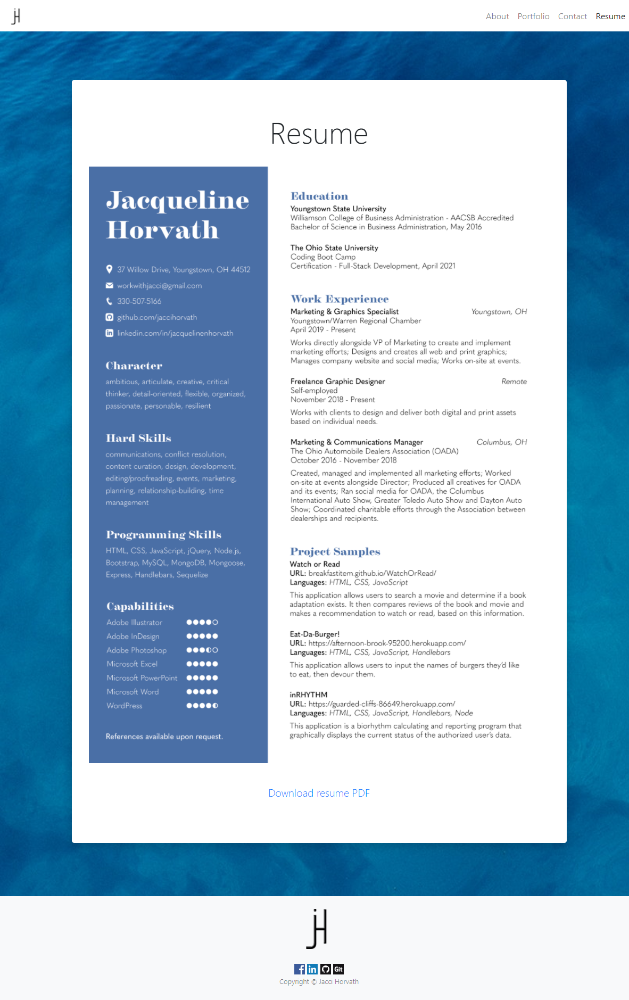

# Responsive Portfolio

## Description

In this repository, you will find a responsive portfolio comprised of the following four pages:
* About Me 
* Portfolio 
* Contact 
* Resume

Each of the pages feature:
* A responsive layout
* A background image
* A fixed-top navbar that includes my personal logo and links to the other pages
* A sticky footer that includes my personal logo, links to my social media accounts (that open in a new window) and copyright Jacci Horvath

## Technologies Used
* HTML
* CSS
* jQuery
* Bootstrap
* Font Awesome

### About Me

The About Me page is comprised of a headshot and a short paragraph about myself that includes links to my portfolio, contact and resume pages.

### Portfolio

The Portfolio page is comprised of image cards with five completed projects. Each image card contains the title of the project, a link to the deployed application and a link to the GitHub repository that houses the code.

### Contact

The Contact page is comprised of a form that allows the user to send me an email, as well as my email address and phone number. The fillable fields include:
* Name
* Email Address
* Message

## Mock-Up

The finished project can be deployed [here](https://jaccihorvath.github.io/responsive-portfolio/).

### Screenshots

## Contact Information
Jacci Horvath, [workwithjacci@gmail.com](mailto:workwithjacci@gmail.com), 330-507-5166