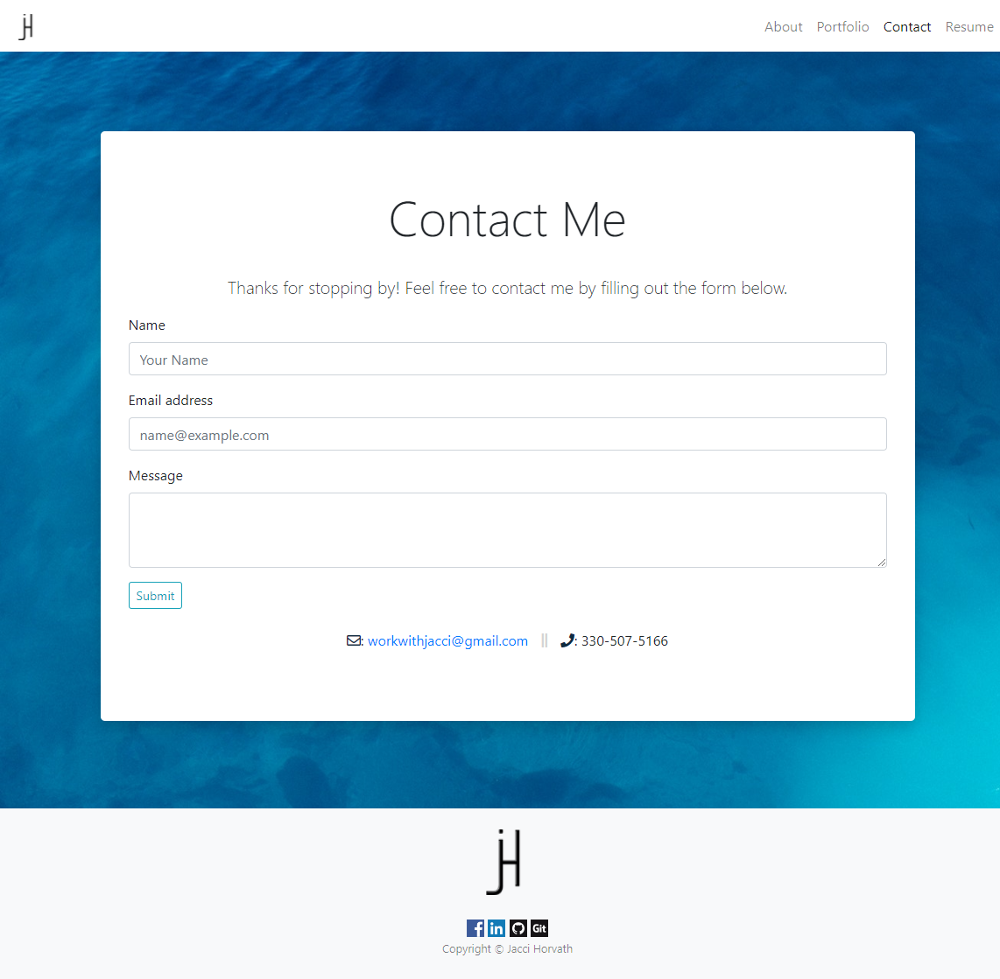
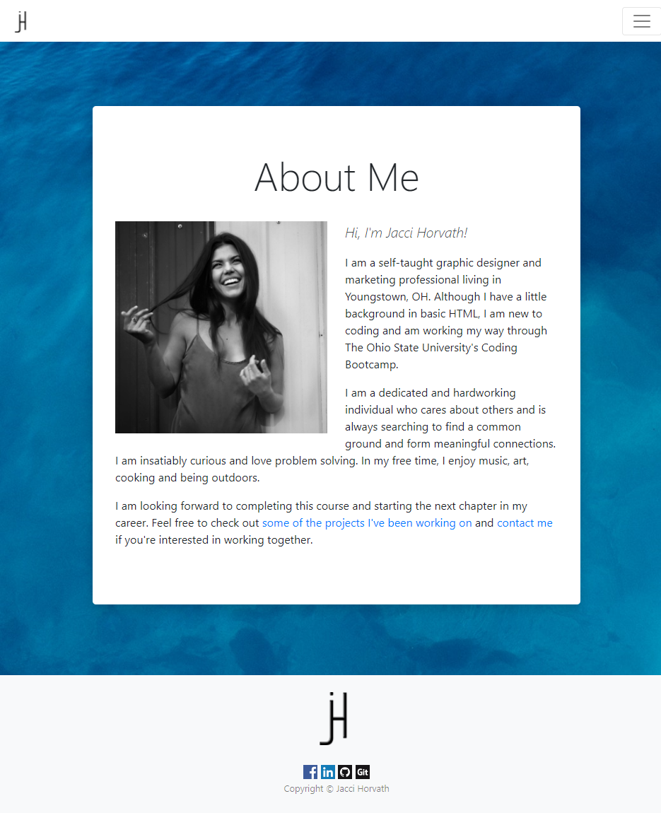
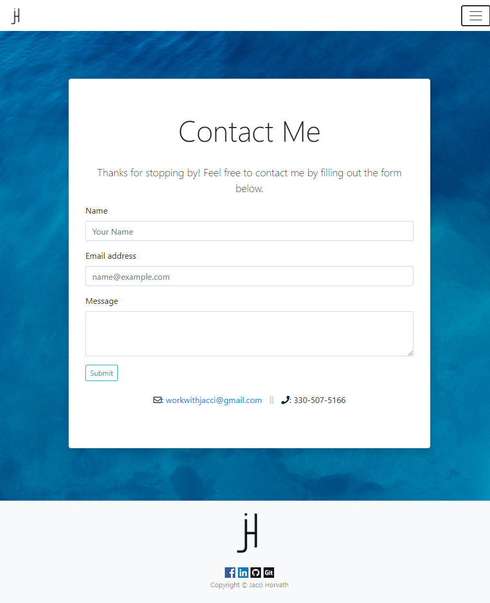
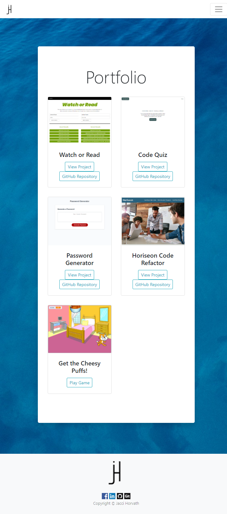
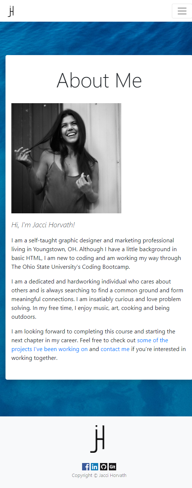
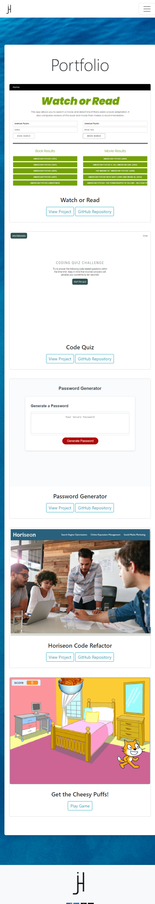

# Homework 02: Responsive Portfolio

## Description

In this repository, you will find a responsive portfolio comprised of the following three pages:
* About Me 
* Portfolio 
* Contact 

Each of the pages feature:
* A responsive layout
* A background image
* A fixed-top navbar that includes my personal logo and links to the other pages
* A sticky footer that includes my personal logo, links to my social media accounts (that open in a new window) and copyright Jacci Horvath

### About Me

The About Me page is comprised of a headshot and a short paragraph about myself that includes links to my portfolio and contact pages.

### Portfolio

The Portfolio page is comprised of image cards that include a photo of two completed projects and links that allow the user to either view or play the respective projects.

### Contact

The Contact page is comprised of a form that allows the user to send me an email. The fillable fields include:
* Name
* Email Address
* Message

## Mock-Up

The finished project can be deployed [here](https://jaccihorvath.github.io/responsive-portfolio/).

### XL Viewport

### LG Viewport

### MD Viewport

### SM Viewport

### XS Viewport

